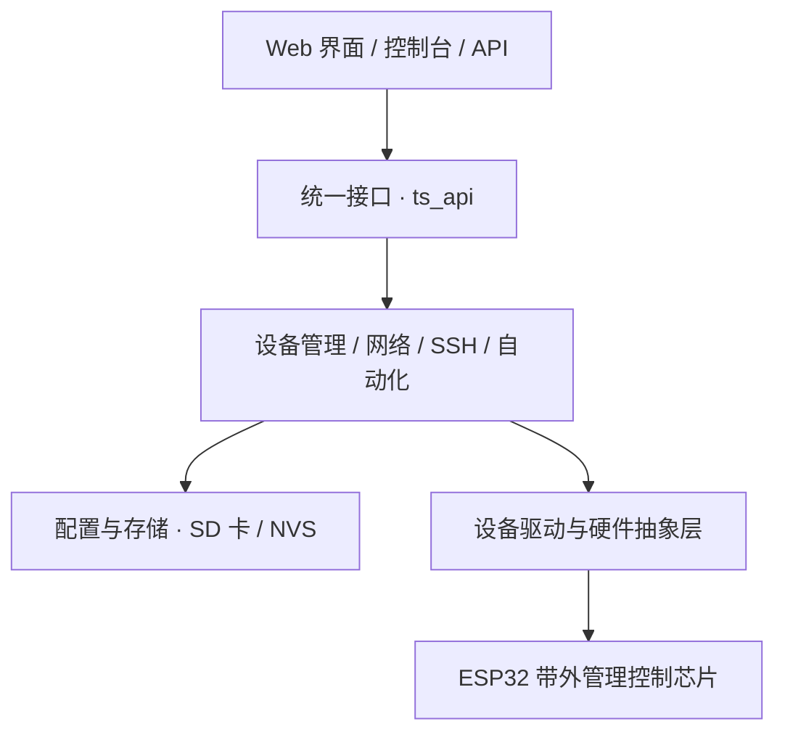

[English](README_EN.md) | [中文](README.md)

# TianshanOS · 天山OS

TianshanOS 是 RM-01 的设备管理系统，运行在 ESP32 带外管理控制芯片上。你可以通过浏览器查看设备状态，管理电源、风扇和灯光，配置网络，也可以设置 SSH 指令和自动化规则。

## 主要功能

| 功能 | 你可以做什么 |
|---|---|
| 设备状态与电源 | 查看温度、电压、功率和系统状态，控制 AGX 与 LPMU 电源。 |
| 风扇与灯光 | 调整风扇转速，设置自动控制和温度曲线，管理灯光、特效和显示内容。 |
| 网络与文件 | 配置 Wi-Fi 和以太网，浏览、上传和下载设备文件。 |
| SSH 指令 | 管理远程主机和指令，执行命令，查看服务状态并启动或停止服务。 |
| 自动化与快捷操作 | 设置数据源、条件和动作，将规则显示为首页快捷操作。 |
| 安全与更新 | 管理账号、SSH 密钥和证书，查看版本并更新固件。 |

## 开始使用

1. 为 RM-01 接通电源，并将设备接入网络。
2. 在同一网络中的电脑上打开浏览器，输入设备的 IP 地址。
3. 使用设备账号登录，在首页查看状态并打开需要的功能页面。

终端、指令和自动化页面需要 root 权限。配置保存、SD 卡备份和固件更新的操作步骤，请参阅用户说明。更新 0.6.1 固件时，应用固件和 Web 界面资源应使用同一版本。

## 用户说明

详细用户说明请前往 [RMinte 官网 www.rminte.com](https://www.rminte.com/) 下载，包括日常操作、账号权限、配置保存和故障处理。

## 架构

系统基于 ESP-IDF。当前仓库提供 RM-01（ESP32-S3）的板级配置。



## 主要目录

```text
TianshanOS/
├── boards/             # 板级配置：引脚、设备和服务
├── components/         # 系统服务、设备驱动和 Web 界面
├── main/               # 系统启动入口
├── docs/               # 技术文档与版本说明
├── tools/              # 构建、版本管理及服务工具
├── sdcard/             # SD 卡资源
├── partitions.csv     # Flash 分区表
├── sdkconfig.defaults # 默认构建配置
└── version.txt        # 版本号
```

## 许可证

本项目采用 [GPL-3.0 许可证](LICENSE)。
