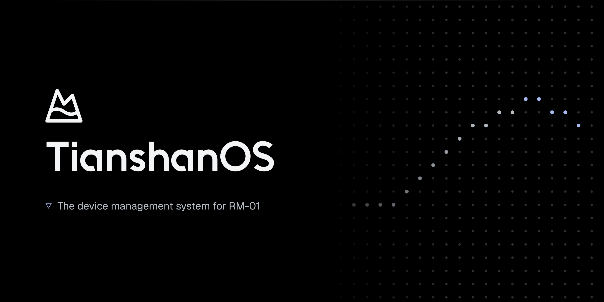
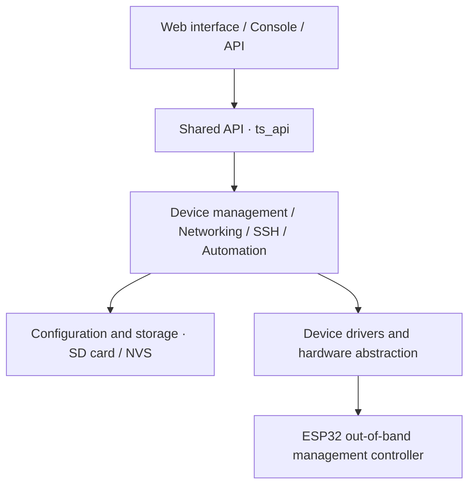

[English](README_EN.md) | [中文](README.md)

# TianshanOS

TianshanOS is the device management system for RM-01. It runs on the ESP32 out-of-band management controller. Use a browser to check device status, manage power, fans and lighting, configure networking, and set up SSH commands and automation rules.

**Current version: 0.6.1** · Web interface in Chinese and English · [0.6.1 release notes (Chinese)](docs/releases/v0.6.1.md)

## Features

| Feature | What you can do |
|---|---|
| Device status and power | Check temperature, voltage, power consumption and system status. Control power to the AGX and LPMU. |
| Fans and lighting | Adjust fan speed, configure automatic control and temperature curves, and manage lighting, effects and display content. |
| Networking and files | Configure Wi-Fi and Ethernet. Browse, upload and download files on the device. |
| SSH commands | Manage remote hosts and commands, run commands, check service status, and start or stop services. |
| Automation and quick actions | Configure data sources, conditions and actions. Show rules as quick actions on the dashboard. |
| Security and updates | Manage accounts, SSH keys and certificates. Check the firmware version and install updates. |

## Getting started

1. Connect RM-01 to power and a network.
2. Open a browser on a computer connected to the same network and enter the device's IP address.
3. Sign in with your device account. Check status on the dashboard and open the page you need.

The Terminal, SSH Commands and Automation pages require root access. See the user guide for configuration saving, SD card backups and firmware updates. When updating to 0.6.1, use matching versions of the application firmware and Web interface resources.

## User guides

Download detailed user guides from the [RMinte website at www.rminte.com](https://www.rminte.com/). They cover everyday tasks, account permissions, configuration saving and troubleshooting.

## Architecture

The system is built on ESP-IDF. This repository includes the board configuration for RM-01 (ESP32-S3).



## Main directories

```text
TianshanOS/
├── boards/             # Board configuration: pins, devices and services
├── components/         # System services, device drivers and Web interface
├── main/               # System startup
├── docs/               # Technical documentation and release notes
├── tools/              # Build, version management and service tools
├── sdcard/             # SD card resources
├── partitions.csv     # Flash partition table
├── sdkconfig.defaults # Default build configuration
└── version.txt        # Version number
```

## License

This project is licensed under [GPL-3.0](LICENSE).
