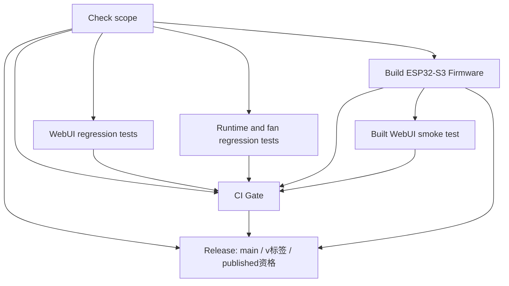

# GitHub Actions 改进设计与审查交接 v2

日期：2026-10-10（Asia/Shanghai）
状态：完整实施设计，按用户明确要求修订；本轮仅修改设计，不执行代码、工作流或 GitHub 设置变更。

## 修订记录与本版效力

- v1及上一轮审查对发布方向的判断有误，现明确撤回。本版以用户已经确定的“同意合并到上游main后，按项目版本自动发布”为准，不再把它作为待选择的新方向。
- main push一律完整检查；只有明确的非发布纯文档PR可轻量检查。changes统一提供范围与发布资格，release直接依赖changes/build/ci-gate。
- main已有Release正常跳过；需要新发布才检查标签与构建提交是否一致。保留版本标签和release:published上传入口，手动运行维持只构建。
- Gate纳入最终判定时可观察到的运行取消状态，不承诺追溯修改已完成的成功结论。
- 同步已有发布测试的main=True预期与新依赖接线；补gzip缺失、资源失败阻断和current-only共用准备细节。
- 接受不强制PR分支更新的初版取舍，区分合并关卡和main发布前的完整检查。

v1保留为历史记录。本文件为完整全文，未变部分已带入；后续审查和实施只以v2为准，不需拼接v1。

## 1. 目标、位置与授权

目标是把已有测试变成可靠的合并关卡，补上构建后Web成品的验证，并让main自动发布使用本次完整CI成功的工件。保留项目现有发布用途，不重设计发布流程，也不通过增加测试数量来宣称覆盖所有硬件风险。

- 分支：`massif/ci-gates-plan`。
- 独立目录：`/Users/massif/.codex/worktrees/ci-gates-plan/TianshanOS`。
- 起点：上游 `RMinte-AI/TianshanOS` 的 `main`，`50093e1720b2e76878ed9a9f989125f35e5e0629`。
- 用户本轮授权：在原规划分支修订完整设计。没有授权现在改代码、工作流、测试或GitHub设置。
- 本轮只新增此文档；不提交、推送、创建 PR、修改主目录源码或其他工作目录。
- 审查通过并由用户确认实施后，先完成代码和CI改进PR；请求用户合并前说明当时版本、对应Release状态及预计发布/跳过结果。用户批准合并到上游main后，符合条件的自动发布就是预期行为。合并后完整CI通过，再经用户授权配置GitHub合并规则；不擅自替用户合并，也不为验收人为创建真实发布。

上游当时仍有 PR #47 未合并，最新头为 `bdc987d93d6050de2602528f2750ede89225c276`，标题已扩展为“修复自动化删除保护并实现规则配置包导入”。此方案不合入、修改或重审那条分支。实施前须重新核查上游 main、PR #47 的最终状态和本地差异；如果它已合并，将其新增测试入口保留，再更新本方案对应清单。不能用当前旧版 package.json/run_all.sh 覆盖届时的新版本。

## 2. 原始问题与证据边界

v1已只读核查工作流、测试入口、Web打包流程及上游设置；本轮复核了发布条件、现有发布测试、gzip生成约定、xterm失败处理、服务停止脚本和最新main/PR #47状态。未运行测试，未宣称新入口已在Ubuntu通过。表内主分支规则是v1核查快照，设置前须重新读取。

| 当前事实 | 含义 |
|---|---|
| 有 ESP32-S3 完整构建、SPIFFS 打包、真实 Chrome 页面回归、ASan/UBSan 主机测试 | 现有 CI 已有实质防护，保留这些能力 |
| 主分支 API 返回 `protected=false`，适用于 main 的 rules 列表为空 | 检查目前没有成为强制合并条件 |
| npm 有 `test:xterm`，工作流未调用 | 真实离线终端及 vendor 完整性回归尚未形成 CI 门槛 |
| CSR 仅编译 test_subject；证书材料/生命周期/协调器等已有套件未全部接入 | 复用现有测试，而非新写一套模拟算法 |
| WebSocket 只接入 run_operation_adapter.sh | 订阅管理、事件注销、排空停止等现有回归未全部接入 |
| 浏览器主要服务源码；test_web_minify.py 仅验证两个 CSS 片段 | 源码通过不能直接证明压缩后页面能加载 |
| 工作流对 docs/** 和 Markdown 在入口做 paths-ignore | 如果直接把它设为必需检查，纯文档 PR 可能没有检查结果而无法合并 |
| Release job包含upstream main push、v标签、release:published入口 | 这是用户要求保留的项目行为；要衔接本次完整CI/Gate，并区分main同版本跳过与published入口上传 |

本设计不把主机模拟等同 ESP32 调度、真实 SSH、Flash 断电恢复或实际热控验收。正式设备发布仍需针对修改内容做真机验收。

## 3. 实施范围和明确不做的事

包含：

1. 始终返回状态的 CI 汇总门槛，解决文档 PR 与失败/跳过的语义。
2. 接入现有 xterm、证书和 WebSocket 当前生产行为回归。
3. 验证真实构建出的 Web 目录，复用已有浏览器用例，不重新运行全部浏览器矩阵。
4. 保留上游main按项目版本自动发布、版本标签与release:published上传入口；普通PR、develop及fork无上游发布资格，workflow_dispatch仍只构建。
5. 流程稳定后配置 main 的 PR/CI 规则及可撤销的上线步骤。

不包含：固件业务修改、新架构、所有历史反例重放、多平台构建矩阵、整仓格式改造、全局 -Werror、任意性能/内存阈值、生产凭据或真机操作、SDK升级、为验收升级版本/打发布标签/调用真实发布、擅自合并现有PR。用户批准合并后符合条件的自动发布属于预期流程，不是被禁止的验收实验。不给“CI 通过等于产品没有缺陷”的承诺。

## 4. 工作流结构与合并判定

保留现有一个 build.yml，初版不拆多套互相调用的工作流。新增少量有明确职责的任务，不增加跨仓库服务。

| Job ID / 显示名 | 职责 |
|---|---|
| changes / Check scope | 唯一范围/发布资格来源，输出run_full、publish_release；main、标签、published、手动运行强制完整，只有非发布纯文档PR可轻量；运行轻量策略和现有release校验测试 |
| web-tests / WebUI regression tests | 原静态/交互/浏览器回归，增加源码 xterm 检查 |
| runtime-tests / Runtime and fan regression tests | 原运行时/风扇/适配器测试，接入当前证书与 WebSocket 回归 |
| build / Build ESP32-S3 Firmware | 维持当前目标与SDK，构建app/www；上传前核对www.bin生成及同次flasher_args映射，再上传固件及真实Web成品目录 |
| web-artifacts / Built WebUI smoke test | 下载本次build生成目录，核对JS/CSS/HTML应有gzip及内容，复用离线终端场景，非预期资源失败必须阻断 |
| ci-gate / CI Gate | 始终评估前述结果及最终判定的运行取消状态；唯一建议设为必需检查的名称 |
| release / Create or Update Release | 直接needs changes、build、ci-gate；读取changes唯一资格并要求本次Gate/build成功；按现有main/标签/published用途使用同次工件 |

### 4.1 事件与改动范围

删除工作流入口的 paths-ignore，让 PR 总能获得 CI Gate。将“是否跑重任务”放在任务内部，不用整个工作流缺席来表达通过。

普通文档白名单初版仅为：根目录 README.md/README_EN.md，及 docs/ 下的 Markdown。只要改动包含其他路径就跑完整检查。重命名同时考虑旧路径和新路径，不能把代码搬进 docs 后误判为文档。删文件也要被识别。

- docs 下的 vendor.json、归档、脚本、HTML等不属于普通文档，按代码变更处理；它们可能是测试输入。
- 顶层品牌图片初版仍按完整检查处理；不增加一套图片用途推断规则。
- release 文案变更即使属于普通文档，仍执行现有 test_release.py；它确实校验当前 version.txt 与当前说明。
- PR 混合改代码和文档，跑完整检查。
- 上游main push一律完整检查，包括纯文档；标签、release:published、手动运行也强制完整。初版所有已支持非PR运行均完整，develop/fork仍没有上游发布资格。
- 只有PR需要按白名单判定轻量路径；无法确认纯文档的PR（如无可判定改动）跑完整检查。main不按diff或远程Release状态优化，不复用其他运行的工件。
- 读取事件、取 diff、解析结果等真正失败，应使 changes 失败；不能把错误当作“没有改文件”。

changes使用仓库内小脚本处理GITHUB_EVENT_PATH与PR的git diff机器输出；不请求额外GitHub写权限，不引入新的过滤action。相关checkout获取所需历史，PR以事件base/head SHA判定；GitHub构建检验其提供的PR合并候选。非PR由事件直接确定完整检查，无须另一套push diff分类。

publish_release是“允许进入发布路径”的资格，不是“已经发布成功”：只有上游main push、合法v标签push、release:published有资格。PR、develop、fork和workflow_dispatch均无资格。changes不远程查询Release来决定是否构建；即使main版本已经发布，run_full和publish_release仍为true，后面的main预检再记录正常跳过。

release必须直接声明 `needs: [changes, build, ci-gate]`，读取 `needs.changes.outputs.publish_release`，并要求build和Gate结果均为success；不能通过间接依赖读取changes输出，也不能另复制一套事件分类条件。下游main/标签/published的差异只是已获资格后的资产处理方式，不重新判断发布资格。

### 4.2 CI Gate 真值规则

CI Gate 使用 `if: always()`，needs 包含 changes 和全部四个重任务；不依赖 shell 最后一个命令偶然返回0。

- changes 失败、取消、输出缺失或值不合法：失败。
- run_full=true：web-tests、runtime-tests、build、web-artifacts 必须全部 success；任一 failure/cancelled/skipped 都失败。
- run_full=false：仅允许上述四项为设计预期的 skipped；轻量检查必须成功，且 publish_release 必须为 false。
- build 失败导致 web-artifacts 自动 skipped，整体仍失败。
- 最终判定须读取平台的运行取消状态（如将最终步骤的cancelled()作为实际Gate输入/条件）；即使依赖都成功但当前运行已取消，也不能给出通过。不能只看needs里的cancelled结果。

取消边界：Gate最终判定能观察到的取消必须拒绝；已经完成的成功检查不会因后来的取消被本方案追溯撤销。不增加轮询、API状态回写或撤销系统。正常取消导致任务被终止时，不能靠另一个默认成功步骤补出绿灯。

明确选择跳过和任务异常未执行是两种状态。GitHub设置只要求CI Gate，但此汇总不能弱化它对各重任务的判断。`[skip ci]` 不作为文档优化办法，因它可能使必需状态不出现。

## 5. 现有回归的接入方式

### 5.1 WebUI 与 xterm

保留 npm test 和 test:browser，增加现有 `npm run test:xterm --prefix tests/prompts`。Chrome 已安装，复用现有依赖和锁文件。

只新增执行入口，不新增账号/语言/视口矩阵，不重复完整 WebUI 套件。xterm-offline 的输出改由 OFFLINE_RESULTS 指向 RUNNER_TEMP，避免测试改写受版本管理的修复证据。

### 5.2 证书当前回归

复用 runtime-tests 已准备的匹配 SDK cJSON/MbedTLS。MbedTLS只构建一次，随后以明确环境参数调用现有 tests/certificate/run_host.sh；现有独立 CSR subject 编译步骤由该入口覆盖，避免重复执行。

接入 subject、time_retry、material、UI、lifecycle、coordinator、API、time_cancel，以及服务停止的当前实现检查；不改已有断言，不删除测试用例。

必要适配：

- 使用 workflow 的 Python，显式 CERT_TEST_PYTHON=python3、CERT_TEST_BUILD/CERT_MBEDTLS_BUILD 指向 RUNNER_TEMP；不依赖 /Users/massif 的默认路径。
- 声明生成临时证书所需 cryptography 依赖。当前已验证本机版本为44.0.3，建议作为初版固定版本；Ubuntu实际通过后才承认其兼容，不升级生产依赖。
- 保留合成证书和模拟时间；不访问生产密钥或真实设备，不把测试时间改成系统实时时间。
- 主机代码确有 strdup/pthread/usleep 等需求；按已有 run_ssh.sh 的兼容方式启用所需声明。不能照搬只开放POSIX 2008的参数而再次隐藏 usleep，也不把这些参数加到固件编译。
- test_service_stop.sh增加窄的--current-only模式，默认历史证据行为保留，常规run_host用current-only。必须先做共用准备：临时目录、当前源码读取及当前 `service_restart.inc` 生成，均不依赖历史基线分支。历史git show、旧stop文件生成、旧二进制编译及预期失败，仅在历史模式执行。随后两种模式都生成当前 `service_stop.inc`、编译当前二进制并执行停止和重启断言。不能因为跳过基线而漏掉restart输入文件；不删除当前断言。

若现有断言暴露真实业务缺陷，不降低断言、不吞错误；作为独立阻断项交用户判断是否另开修复。不能借 CI 适配修改证书业务。

### 5.3 WebSocket 当前回归

继续执行 run_operation_adapter.sh，并接入已有：

- tests/ws_subscriptions/run_host.sh：manager、event、HTTP/WebUI生命周期、WS初始化。
- tests/ws_subscriptions/run_reviewer.sh：当前排空、会话/代次、停止失败传播及核心回滚等回归。
- tests/ws_subscriptions/run_f1_f2.sh：默认当前实现模式，入队/发送、迟到结算和竞争等已有断言。

不运行 run_baseline.sh、run_reviewer_baseline.sh 或 --baseline；不再重放旧漏洞来充当常规生产通过条件。检查这些入口是否重复启动同一子套件，重复者只执行一次；不同不变量不能按文件名相近而删掉。

仅适配当前脚本的 SDK/临时目录/编译器接口和真实 Linux 编译问题，保留 ASan/UBSan。不能先宣称这些尚未接入的脚本已经在 Ubuntu 跑通。

## 6. 成品 Web 检查

检验对象是本次idf.py build真正生成的 `build/esp-idf/ts_webui/web_optimized`，不能从源码另压缩一个目录替代。

build在优化及SPIFFS成功后、上传任何工件之前，直接核对：本次 `www.bin` 已生成、在同次 `flasher_args.json` 的flash_files映射中、映射指向实际本次文件。将失败归到build，不把这些文件交给只下载Web目录的任务后猜测。

随后上传真实Web目录为短期CI工件，名称含本次github.sha；保持现有固件工件上传。同次run的Web目录与固件共同进入Gate，不能下载上次运行的目录。CI artifact不是Release。

web-artifacts下载本次目录，做三件事：

1. 用Node22解析生成的完整JS，包括app/api/router/terminal/语言包及vendor；不是只查原始源码。
2. 按现有minify_web.py约定，从原始资源清单枚举所有JS、CSS、HTML，为每个资源要求对应 `.gz` 存在，再解压逐字比较。缺一个或全部没生成都失败；gzip异常或孤立的.gz缺原文件也失败。不能只遍历已经存在的.gz。确认index、语言包及终端vendor这些现有场景输入存在。
3. 设置PROJECT_WEB_ROOT指向该目录，复用现有xterm-offline.test.cjs的中英文场景。保留真实终端交互、离线限制、退出重进与现有视口变化，不新增浏览器、账号、视口或语言矩阵。

资源失败必须成为结果：路由读取本地静态文件失败、履行/请求失败均记录具体URL与原因；非预期失败最终断言为零，必要的缺失也可立即使场景失败。不能catch后只打印日志或abort，然后仍因终端主体初始化成功而通过。维持外部请求限制；已有明确设计的mock请求/关闭清理须区分，不能放宽成吞掉任意失败。既有pageerror和交互断言保留，输出写RUNNER_TEMP。

新增负例限定为改变放行结果的样本：删除一个应有gzip后必须失败、内容不匹配/生成JS损坏仍失败、缺一个本地资源时失败确实进入判定。使用隔离目录，正常实际构建目录应通过，不扩压缩率、性能阈值或文件名组合测试。

此检查证明生成目录中的页面可加载，不宣称验证设备HTTP服务器、实际SPIFFS挂载或真实网络。不新增SPIFFS解包重建或硬件刷机。

## 7. 发布策略：保留main自动发布及既有入口

发布策略已由用户确定。本轮仅将它接到同次完整CI/Gate并修正必要预检，不重设计发布用途。

“带版本号”指项目现有version.txt、构建版本及发布说明机制：不检查提交消息有没有版本号，不要求本次diff修改version.txt。上游main当前版本合法且未发布、其他条件满足，就具备自动发布资格。用户批准合并后无需再手工打标签或点击发布。

### 7.1 最终事件—检查—发布行为表

| 事件/仓库 | run_full与检查 | 发布资格及实际行为 |
|---|---|---|
| 上游main push，包括纯文档 | true，全部重任务和CI Gate | 有资格；本次完整CI/Gate成功后，按项目版本自动创建尚未存在的Release；已有则记录正常跳过，不上传新资产 |
| 上游纯文档PR，全部路径在白名单 | false，轻量检查和CI Gate，重任务按设计skipped | 无资格，不发布 |
| 上游源码/混合PR | true，全部检查和Gate | 无资格，不发布 |
| 上游develop push | true，全部检查和Gate | 无资格，不发布 |
| 上游v*版本标签push | true，全部检查和Gate | 保留现有按该标签发布/上传入口，满足版本与提交一致性后使用本次工件 |
| 上游release:published | true，全部检查和Gate | 保留为已经发布的Release构建上传工件的用途，不因该Release存在而跳过上传 |
| workflow_dispatch | true，全部检查和Gate | 仅构建，无发布资格；不新增手动发布模式或发布开关 |
| fork运行 | PR可按同一白名单选择，其余已支持事件完整检查 | 始终无上游发布资格 |

Gate/build任一失败、取消或未执行时，即使事件有资格也不得发布。main完整检查不受文件类型、远程Release查询结果或跨run缓存工件驱动的跳过逻辑影响。

### 7.2 统一接线和同次工件

changes是唯一发布资格来源；release直接needs changes、build、ci-gate，读取它的资格输出，要求本次build/Gate均success。普通PR不出现可运行的写权限发布任务，其余任务默认contents:read；只有发布任务授予contents:write，资格限定上游RMinte-AI/TianshanOS。

main目标标签沿用 `v{项目语义版本}`；v标签push取事件标签；published取github.event.release.tag_name。保持tools/check_release.py对version.txt、构建版本、标签和详细中文发布说明的校验。不改变项目版本命名，构建哈希/时间后缀不是新语义版本。

下载本次build的固件工件，记录实际构建提交；不能把main当前HEAD或其他运行的工件替代本次提交。版本标签/published入口核对标签解析后的commit和实际构建commit一致，保持现有上传用途。

### 7.3 main自动发布的顺序

在同次完整CI成功后：

1. 校验当前项目版本、实际构建版本及对应发布说明，得到目标版本标签。
2. 查询目标Release，明确区分存在、确实404不存在与权限/网络/服务异常。异常明确失败，不把所有非零结果当作“可以新建”。
3. 如果该版本Release已存在，直接正常跳过创建及上传，日志必须写“该版本已存在，本次未发布新资产”。不能写成本次提交已经发布。此处不再用旧标签与新main提交不同来阻止正常跳过。
4. 仅确认需要新发布后，检查目标标签。标签不存在时，允许沿用现有机制，为本次实际构建提交创建对应标签与Release，不要求标签事先存在。
5. 标签已存在且解析后的commit等于本次构建commit时，可发布；若不同则明确失败。不得移动标签，不得向不匹配标签上传本次资产。标签查询/解析的权限、网络或服务错误同样不是“不存在”。
6. 使用同次工件执行发布。失败据实报告，不把失败或跳过表述为已发布。

### 7.4 标签与published路径的区别

main“已有Release则跳过”不能作为所有入口的通用规则。v标签push保留现有创建/上传语义；release:published本来就是在已有Release上上传本次构建工件，不能因查询200而失去作用。两条入口仍先要求版本、提交、Gate与工件一致，遇到查询异常失败，不把鉴权失败当成不存在。

既有Release上传入口保持现有资产用途，不因本轮审核扩出新的覆盖/迁移策略。资格判定只在changes中定义；获资格后的跳过/创建/上传预检是处理不同现有用途，不另起第二套发布分类。

本轮规划以及将来的实施验收，不人为升级version、不打发布标签、不调用真实发布来做实验。但用户批准CI改进PR合并到main后，条件满足的自动发布是预期行为，不能再禁用它。

## 8. GitHub合并规则：代码稳定后再配置

这部分属于仓库设置，不进入git diff。推荐在CI改进PR合并、合并后普通push检查成功后执行，且操作前由用户确认具体设置及管理员约束。

建议值：

- main要求通过PR合并。
- 必需检查仅为精确名称 CI Gate，来源绑定 GitHub Actions；内部保证四项所选检查通过。
- main禁止强推、禁止删除，建议管理员也遵守同一规则。
- 不引入强制人工审批人数、签名、线性历史、merge queue或部署要求；它们不是本次CI目标。
- 不将Release设为必需检查，因为普通PR按设计不运行它。

暂不强制分支更新，不增加merge queue或多平台矩阵。PR检查只证明它当时检查的合并候选；较早通过的PR不一定验证了后来合入main的其他改动。接受这个初版取舍，不能称为完全消除了合并风险。

上游main随后执行完整检查，用于阻止失败版本自动发布；它不能阻止所有问题提交先进入main，也不自动回滚已经合入的提交。未来引入队列才需要另评估merge_group，本轮不扩大治理。

操作前读取并保存适用的组织/仓库规则与保护设置。只修改本次获批字段，避免覆盖当时其他人新加的规则。操作后用API回读、做非破坏性门槛验收；不为了测试阻断而实际向main推坏提交。规则入口若不允许精准配置或权限发生变化，报告实际限制，不绕过。

## 9. 拟改文件

| 文件 | 改动性质 |
|---|---|
| .github/workflows/build.yml | always Gate、main强制完整、已有套件和成品任务；保留main/v标签/published入口，release直接needs changes/build/ci-gate并读取唯一资格 |
| tools/ci/check_profile.py | 小型事件/改动判定，输出run_full/publish_release；错误不能输出通过 |
| tools/ci/check_gate.py | 实际汇总决策，校验scope输出、必需任务及最终可观察到的运行取消状态 |
| tools/ci/check_web_artifacts.py | 应有gzip存在及内容、生成JS；www与同次flasher映射由build上传前调用相应核对，浏览器复用已有用例 |
| 发布预检代码（可为tools/ci/check_release_state.py） | 仅获资格后执行实际Release查询/状态和标签提交检查；区分main跳过与published上传，不重复事件资格分类 |
| tests/release/test_release.py | 保留main=True和现有版本/说明校验，改旧依赖硬编码以验证Gate及唯一资格的实际接线；不开发通用表达式解释器 |
| tests/ci/test_policy.py | 直接调用真实scope/Gate/发布预检代码；隔离响应验证main创建/跳过、fork/PR拒绝、Gate失败和新发布标签不匹配等必要场景 |
| tests/certificate/run_host.sh | Ubuntu路径、依赖/声明、临时目录和current-only调用 |
| tests/certificate/test_service_stop.sh | 共用准备与历史验证正确分离，current-only仍生成service_restart.inc和当前stop文件并执行有效断言 |
| tests/certificate/requirements.txt | 主机临时证书生成依赖固定版本 |
| tests/prompts/package.json | 若需统一入口，显式保留现有及届时PR新增测试；不改锁文件除非依赖确有变化 |
| 现有WS脚本及tests/prompts/xterm-offline.test.cjs | 必要Linux/目录适配；xterm明确记录静态读取/请求失败并使非预期失败阻断，保留现有交互和离线断言 |
| docs/ci/下的方案和实施记录、相关测试README | 写明入口、规则、命令、已验证边界及回退方法 |

不会新增固件C文件，不改业务实现、设备SDK配置或主目录源码。上述路径是设计边界，不要求制造无用文件；能在现有入口清楚表达时可省去冗余包装，但所有放行判定须可审查、可测试。

## 10. 验收、顺序与停止条件

实施顺序：重新核对最新main和PR #47并保留新增入口 → 现有回归及必要Ubuntu适配 → 实际成品检查 → scope/Gate/保留现有发布入口的接线 → 定向验证与CI改进PR → 告知当前版本和合并发布预期 → 用户决定合并 → main完整检查 → 再经用户授权配置GitHub规则。

只做能改变判定的验收：

| 必须覆盖的情况 | 预期 |
|---|---|
| 源码/混合PR | 原回归、新接入套件与实际成品检查执行，全部成功Gate才通过，无发布资格 |
| 纯README/docs Markdown PR | 轻量检查和Gate有结果，重项预期skipped，publish_release=false |
| docs中vendor JSON/脚本、工作流改动、代码删除/重命名到docs | 不漏判为普通文档，完整检查 |
| 上游main源码或纯文档push | run_full=true，具备发布资格；不要求版本出现在提交消息或diff里 |
| 应执行任务failure/cancelled/意外skipped，scope失败/无输出/非法输出 | Gate拒绝 |
| 依赖都成功，但最终判定的运行取消状态为true | Gate拒绝；不测试追溯撤销已成功结论的不存在能力 |
| build失败使artifact跳过 | Gate失败，不能发布 |
| main版本合法、Release不存在、标签不存在 | 隔离响应中允许为本次构建提交自动创建标签/Release |
| main版本合法、Release已存在、旧标签指向较早提交 | 正常跳过且日志为“该版本已存在，本次未发布新资产”，不得误报发布或标签冲突 |
| 确认需要main新发布后，标签已存在且commit不同 | 拒绝；不移动、不挂错工件 |
| PR、develop、fork、workflow_dispatch | 没有上游发布资格，手动运行只构建 |
| 发布资格true但Gate/build不成功 | release不执行；不是把main资格预期改成false |
| 上游v标签或release:published、版本/提交一致 | 保留本次工件上传用途；published不会因已有Release而通用skip |
| Release/标签查询为真正不存在与权限/网络/服务异常 | 正确区分；查询异常失败 |
| 生成JS损坏、gzip内容不匹配、删除一个应有gzip | 成品检查失败；正常同次目录通过 |
| 本地静态读取失败或非预期请求失败 | 测试结果失败，不只是打印/abort；原交互、离线、退出重进断言继续执行 |
| 证书current-only | 共用准备产出restart和当前stop文件；当前停止/重启断言执行，不依赖历史坏版本 |

发布测试继续保留main允许进入路径的True预期。tests/release/test_release.py改掉旧 `needs: [build, web-tests, runtime-tests]` 精确字符串要求，结构性核对release直接依赖changes/build/ci-gate、读changes唯一资格、要求Gate/build成功，以及同次tag/说明/工件引用。scope和预检策略通过真实判定函数测试；不再为复杂接线开发通用GitHub表达式解释器，也不另写一套预期算法。

现有version、build版本、tag、中文说明的真实校验保留。工作流语法及实际连线须核对，不能只凭YAML可读取宣称Actions表达式有效。GitHub真实PR验证正常完整路径及Gate；新套件以Ubuntu结果验收，本机通过不替代。

成品负例只用隔离目录。发布状态与标签预检用模拟响应验证，不创建真实Release。不人为升级version、打发布标签、修改生产凭据、时钟、卡或固件；合并后按当前版本自动发布的资格不会因此被关闭。

如需真实验证纯文档Gate，可在用户授权后用fork临时分支/PR；不向上游main推坏样本。既有无关测试不为更保险重复扩跑；不扩浏览器、账号、视口、语言或OS矩阵。

停止条件：规定场景充分验证、最新PR头与结果一致、无新失败原因后停止。不增加取消轮询、状态回写、跨run工件复用、远程Release驱动的构建跳过或新手动发布功能。

记录既有约3分钟级作业及新增成本，检查重复/异常开销；不设未经验证的硬性性能阈值，不为凑时长删除有效断言。

## 11. 合并上线与回退

CI改进PR先保持未合并，保存最终SHA和验证结果。请求用户合并前，重新读取：当前version.txt、实际构建版本、对应Release是否存在，以及相关tag的状态，明确预计结果。

- 版本已发布：预计合并后完整检查成功，main发布路径正常跳过，不新增/覆盖资产。
- 版本尚未发布且其他条件满足：预计合并后完整CI/Gate成功自动发布该版本；不存在标签可按既有机制创建，已有不匹配标签会在确认需要新发布后阻断。
- 读取失败：说明实际错误，不能猜测“已发布”或“不存在”。不为避开发布偷偷修改版本或开关。

本轮复核基线version为0.6.1，v0.6.1 Release存在；若合并时仍相同，预计自动发布路径跳过新资产。这只是当前快照，必须在请求合并前重新核查。

用户批准合并到main后，main一律完整检查；符合条件的自动发布就是预期行为。若CI失败，阻止发布并报告，但不声称因此撤销了main上的提交。不会为了做验收实验额外创建Release。

GitHub规则仍后置：main检查成功、Gate名称与文档路径验收有效后，保存当时旧设置，经用户授权只改变获批字段。不要先配置一个会卡住修复PR的门槛。

回退：代码通过单独revert PR恢复，GitHub仅恢复本次改变字段，不删别人规则；Gate故障时是否临时移除required check由用户决定，修复验证后恢复。保留main自动发布是已经确定的发布要求，不能以本轮回退为由禁用它；回退前同样说明当时版本及预计发布/跳过结果，不恢复v1的错误发布方向。

不擅自合并、强推、删分支或人为打发布标签。合并授权与验收实验有明确区别；用户批准的正常main自动发布无需额外手动操作。

## 12. 给 GPT6 Pro 的审查要求

请只读审查本完整v2与所列源码，回复通过或具体阻断项；不实施、不提交、不更改GitHub设置。发布方向已由用户确定，v1及上一轮审查的相反判断撤回，不再把禁止main自动发布作为改进目标。

重点核对：

1. 是否只补有证据的CI缺口，保留现有有效断言，不把历史坏版本重放塞入常规CI。
2. main、标签、published、手动运行是否完整；纯文档PR能否获得Gate，代码/测试输入/重命名不被漏判。
3. changes是否是唯一资格来源；release是否直接needs changes/build/ci-gate，读唯一输出，并要求同次Gate/build成功。
4. Gate是否拒绝分类错误、非法/缺失输出、失败、取消和意外跳过；是否纳入最终可观察的运行取消，并明确没有追溯撤销承诺。
5. main自动发布是否使用现有项目版本，而非提交消息或version diff；已有Release先正常跳过，新发布才做tag提交检查；允许main为同次构建创建缺失标签，不移动冲突标签。
6. v标签与release:published是否保留既有上传用途，published不被通用“已有则跳过”破坏；workflow_dispatch只构建，fork/PR/develop无上游发布资格。
7. test_release.py是否保留main=True及版本/说明规则，改旧依赖接线要求；策略是否执行真实判定代码而非第二套算法/通用表达式解释器。
8. 成品是否来自同次真实构建；JS/CSS/HTML应有gzip缺失能否失败，资源失败是否确实阻断，build上传前是否核对www与flasher映射。
9. current-only共用准备是否仍生成service_restart.inc与当前stop文件，现有停止/重启断言及ASan/UBSan是否保留；Ubuntu适配是否只处理必要接口问题。
10. 是否承认较早PR检查和后续main改动的边界，GitHub设置仍后置且不加额外治理要求；合并前版本/Release预期与回退沟通是否明确。
11. 实施前是否重新核对main/PR #47等并行工作，增量保留后来新增的package.json/run_all.sh测试入口。

本版发布规则已按用户决定确定，技术实现仍待审查及用户授权。本轮仅新增设计v2，未改代码、工作流或仓库规则，未执行任何测试、发布或分支合并。
